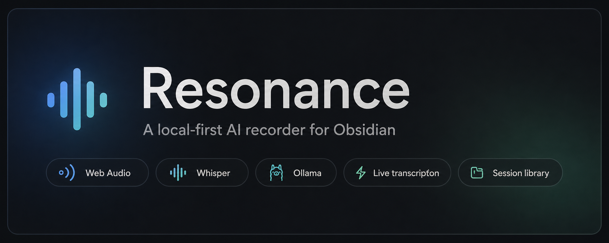
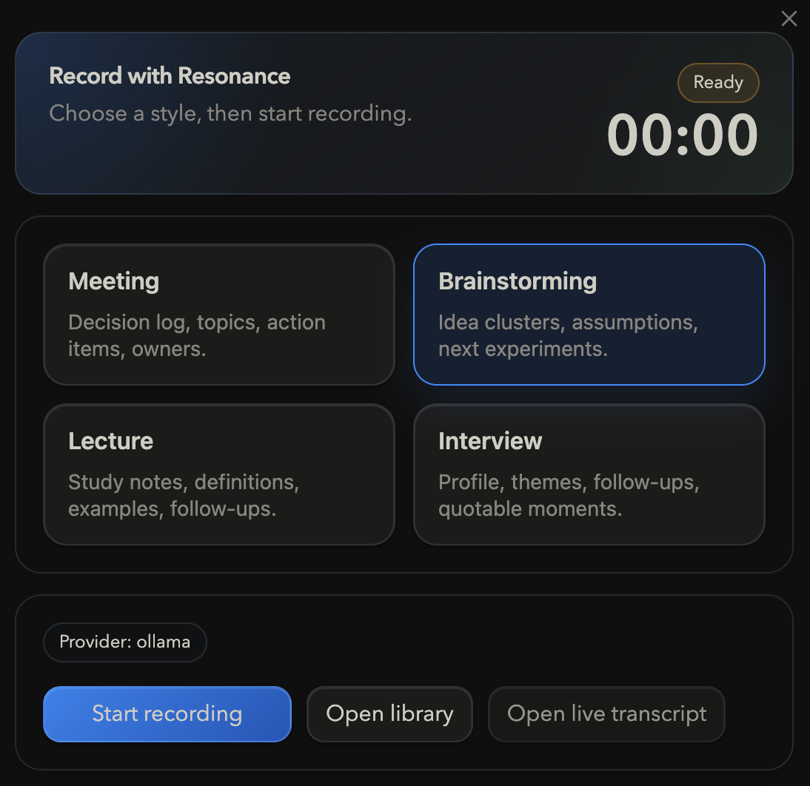
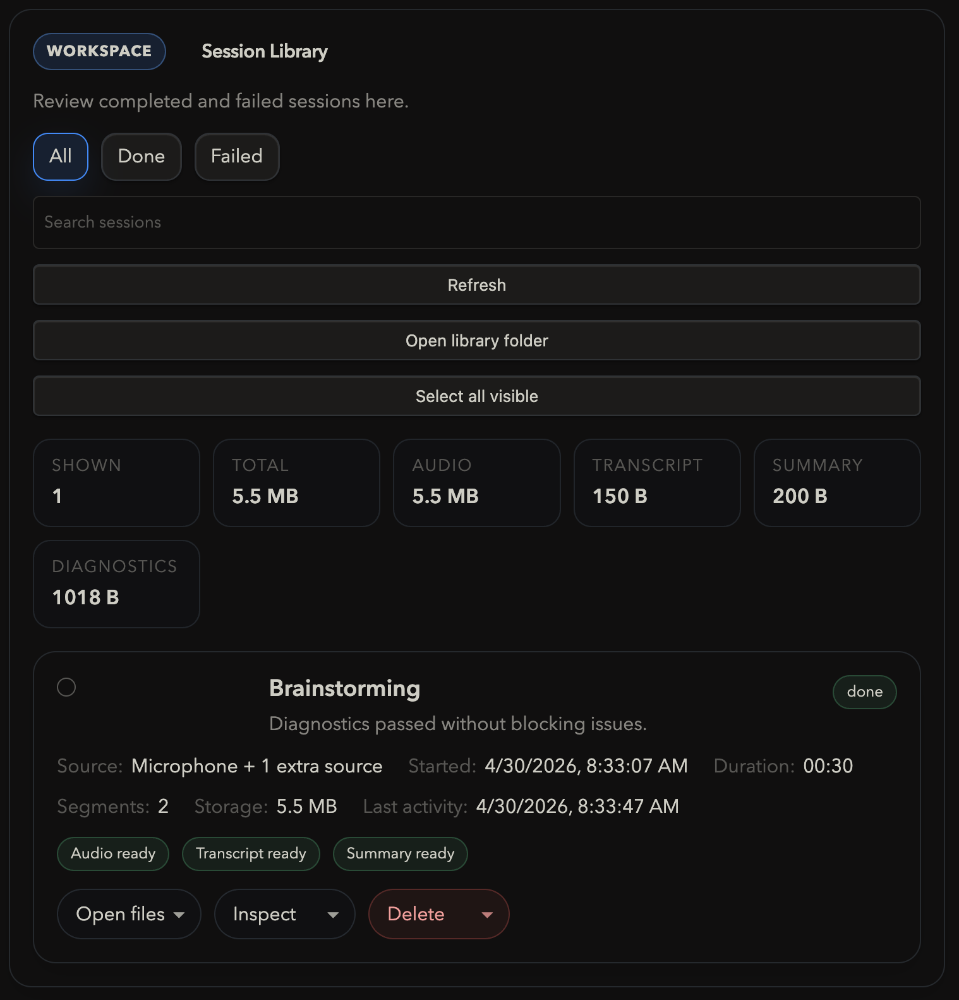

# Resonance



Resonance is a local-first AI recorder for Obsidian.

It is built around:

- Web Audio capture
- Whisper for transcription
- Ollama or an optional cloud provider for summaries
- Session storage with a built-in library

The product is desktop-only.

## What Resonance Does

- Records from one main microphone plus optional extra audio inputs in the same Web Audio graph
- Writes live transcript updates while recording
- Builds a final summary note after the recording stops
- Stores each session with audio, transcript, summary, and diagnostics
- Lets you inspect, recover, clean up, and bulk-delete session artifacts from the Library

## Screenshots

### Recorder



### Library



## First Successful Session

1. Install the plugin in your vault.
2. Open the Resonance settings page.
3. In `Capture`, choose your microphone.
4. Optionally add loopback or monitor inputs under `Additional sources` if you want call or desktop audio in the same recording.
5. In `Transcription`, set the `whisper.cpp` repo, CLI, and model paths.
6. In `Summary`, keep `Ollama` or choose a cloud provider.
7. Run `Quick test`.
8. Open the recorder and make a short recording.
9. Stop the session and confirm that the transcript and summary appear in the Library.

## Setup Overview

### Capture

- `Microphone device`: the voice input you speak into
- `Additional sources`: optional extra audio inputs such as loopback or monitor devices
- `Segment seconds`: how often live transcript updates are committed
- `Quick test`: verifies microphone access and the local pipeline

### Transcription

Resonance expects a local `whisper.cpp` build plus a readable ggml model.

Typical setup:

```bash
git clone https://github.com/ggerganov/whisper.cpp
cd whisper.cpp
cmake -S . -B build
cmake --build build -j
```

Then download a model, for example:

```bash
cd /path/to/whisper.cpp/models
./download-ggml-model.sh small
```

Set:

- `whisper.cpp repo`
- `whisper.cpp CLI`
- `Model path`

### Summary

Recommended local path:

- provider: `Ollama`
- endpoint: `http://localhost:11434`
- model: `gemma3`

Cloud providers are also supported, but they require API credentials on the machine where the plugin runs.

### Library

The Library is the operational workspace for finished and failed sessions.

It supports:

- previewing transcript and diagnostics
- opening transcript and summary notes
- audio playback and export
- recovery actions when transcript or summary is missing
- bulk cleanup with storage estimates
- storage stats for visible sessions

## Runtime Artifacts

Each supported session persists:

- `session.json`
- `audio/recording.wav`
- `audio/segments/`
- `transcript/live-transcript.txt`
- `summary/summary.md`
- `diagnostics.log`

The session Library reads these manifests rather than scanning arbitrary files.

## Common Failures

### Microphone access denied

Symptoms:

- Quick test fails before recording starts
- Capture diagnostics show microphone access denied

Fix:

- Re-enable microphone access for Obsidian in the operating system settings
- Return to Resonance and run `Quick test` again

### whisper.cpp or model missing

Symptoms:

- Diagnostics block recording
- Quick test captures audio but transcription fails

Fix:

- Point Resonance to a working `whisper.cpp` CLI
- Set a readable ggml model file such as `ggml-small.bin`

### Additional source unavailable

Symptoms:

- A saved loopback or monitor input no longer appears
- Diagnostics warn that extra sources will be skipped

Fix:

- Re-select the source in `Capture`
- Remove stale additional inputs you no longer use

## Local Development

Requirements:

- Obsidian desktop
- Node.js
- `whisper.cpp` with a local ggml model
- Ollama if you want the default local summary path

Commands:

```bash
npm run typecheck
npm test
npm run build
```

## Manual Install in Obsidian

1. Run `npm run build`.
2. Copy `dist/main.js`, `dist/manifest.json`, and `dist/styles.css` into your vault plugin folder.
3. Enable `Resonance` in Obsidian community plugins.
4. Open the Resonance settings page.
5. Work through `Capture`, `Transcription`, and `Summary`.
6. Use `Diagnostics` for health checks and `Library` for saved sessions.
